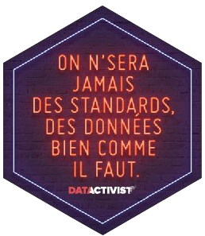

layout: true
  

`r paste0("
", params$event, " 

")` 

---

class: center, middle

Ces slides en ligne : `r paste0("http://datactivist.coop/", params$slug)`

Sources : `r paste0("https://github.com/datactivist/", params$slug)`

Les productions de Datactivist sont librement réutilisables selon les termes de la licence [Creative Commons 4.0 BY-SA](https://creativecommons.org/licenses/by-sa/4.0/legalcode.fr).

 
 

---
## Qui sommes nous ?

    

### We .red[open data], we make them .red[useful]

---
## Qui sommes nous ?

---
## Qui sommes nous ?

- Datactivist est un .red[**pure player de l’open data**] créé en 2016, par Samuel Goëta et Joël Gombin.

- Se positionnant sur .red[**toutes les étapes du travail d’ouverture des données**], Datactivist travaille tant avec les producteurs de données qu’avec les réutilisateurs et participe à l’appropriation des données par chacun.

- Nous appliquons nos propres .red[**valeurs**] : nous sommes une coopérative ; nos supports de formation et nos contenus sont librement réutilisables, publiés en licence Creative Commons.

- Une approche issue de la recherche : voir notamment **https://datactivist.coop/these**. 

- Nous animons la communauté [#TeamOpenData](https://teamopendata.org).

---
## Nos activités

- Conseil sur les .red[**stratégies d’ouverture de données**] : nous aidons les organisations dans la conception et la mise en œuvre de leur stratégie d’ouverture de données.

- .red[**Accompagnement dans la réutilisation de données ouvertes**] : nous aidons les organisations à utiliser les données au quotidien. 

- .red[**Sensibilisation et formation à la donnée**] : nous formons à la culture générale des données, nous enseignons les grands principes et bonnes pratiques de l'open data et nous introduisons à la data science. 

- .red[**Médiation de données**] : nous organisons des hackathons, des open data camps, des expéditions de données...

???

La médiation de données est aussi fondamentalement une animation de communauté(s). 

---
class: inverse, center, middle

# Référentiel ?

---
## Référentiel

.center[]

---
## Référentiel

> En physique, il est impossible de définir une position ou un mouvement par rapport à l'espace « vide ». .red[Un référentiel est un solide, ou un ensemble de points fixes entre eux, par rapport auquel on repère une position ou un mouvement] ; le repérage d'un mouvement nécessite en outre de définir un dispositif servant d'horloge (l'écoulement du temps ne pouvant pas être contrôlé, il faut une succession d'événements temporels). 

Source : <a src='https://fr.wikipedia.org/wiki/R%C3%A9f%C3%A9rentiel_(physique)'>Wikipedia</a>

---
## Référentiel

> Un .red[« repère » (système de coordonnées)] permet de quantifier les positions et les vitesses et ainsi de représenter une trajectoire par une courbe mathématique et de mathématiser l’effet des forces physiques sur les corps.

> L'expression des lois de la physique devrait, si elle est complète, ne pas dépendre du référentiel choisi, mais seule la relativité générale permet cela. 

> Par rapport à un référentiel donné, les équations caractérisant le mouvement dépendent du .red[système de coordonnées] (cartésien, cylindrique, sphérique...) utilisé pour les exprimer. Par contre, le mouvement ainsi exprimé différemment est le même.

Source : <a src='https://fr.wikipedia.org/wiki/R%C3%A9f%C3%A9rentiel_(physique)'>Wikipedia</a>

---
## Référentiel

Ce qui fait référence, ce qui permet de mesurer, ce qui doit .red[être fixe pour qu'on puisse mesurer les variables].

???

Dimension arbitraire : il faut poser de manière arbitraire un référentiel pour pouvoir ensuite mesurer une réalité

---
## Référentiel

Il faut donc .red[faire référence pour mesurer et compter]. 

---
class: center, middle, inverse

# Quantification et pouvoir

---
## Quantification et pouvoir

.center[]

.footnote[Source : Asterix chez les pictes, © Albert René 2013]

---
## Quantification et pouvoir

.reduite[.center[]]

.footnote[Source : Asterix chez les pictes, © Albert René 2013]

---

## Quantification et pouvoir

.pull-left[La statistique est à la fois :

+ outil de .red[gouvernement] (_Statistik_ - 18e siècle), et
+ outil de .red[preuve] (_statistics_ - 19e siècle)]

.pull-right[]

---

## Quantifier, c'est convenir puis mesurer

.pull-left[
> Le verbe quantifier est employé ici dans un sens large : **exprimer et
faire exister sous une forme numérique ce qui, auparavant, était exprimé par
des mots et non par des nombres**.]

.pull-right[]

---

## Quantifier, c'est convenir puis mesurer

.center[.small[

]]

.footnote[*Asterix chez les pictes*, © Albert René 2013]

---

## Quantifier, c'est inscrire et figer une réalité sans cesse mouvante

.center[.small[]]

.footnote[*Asterix chez les pictes*, © Albert René 2013]

---

## Convenir puis mesurer

La statistique est appelée à jouer un rôle de référent supposé neutre, parce qu'elle s'appuie sur des catégories, nomenclatures, définitions stabilisées, partagées, acceptées comme légitimes. 

Point fixe dans le débat public démocratique, fait de positions mouvantes les unes par rapport aux autres.

Ces statistiques légitiment l'exercice du pouvoir, mais en retour l'État et son appareil statistique légitiment des référentiels, des manières de compter. 

---

## Référentiels et réalité

Les statistiques/mesures refléteraient la réalité. Mais elles la font aussi :

> Cette idée n’est pas relativiste, en ce qu’elle ne nie pas l’existence de l’inflation ou du chômage. Mais elle attire l’attention sur le fait qu’.red[inflation et chômage peuvent être pensés, exprimés, définis et quantifiés de multiples façons] ; et que les différences entre ces façons de faire ne sont .red[pas de simples détails techniques, mais ont toujours une signification, historique, politique, sociologique].

.footnote[Source :  [Emmanuel Didier, _Statactivisme_](http://www.editions-zones.fr/spip.php?page=lyberplayer&id_article=184)]

---
## Référentiels et réalité

Parfois la réalité est remise en cause : doutes, controverse... Changement de référentiel. 

Exemple du PIB. 

???

Exemple : le PIB. Passe d'un agrégat économique dans la compta nat d'inspiration keynésienne, à une notion en crise avec la crise éco des 70s, puis devient, avec Maastricht, l'instrument d'une politique de limitation du déficit budgétaire. Enfin, dans les années 2000, remise en cause de cet indicateur dans le cadre de la critique du productivisme. 

Source : [Emmanuel Didier, _Statactivisme_](http://www.editions-zones.fr/spip.php?page=lyberplayer&id_article=184)

---

class: middle, center, inverse

# Les standards

---
## Les standards 

.pull-left[.center[]]

.pull-right[.center[]]

---
## Les standards, une classe de référentiels

Le monde moderne est empli de standards ([Lampland and Star, 2008](http://www.cornellpress.cornell.edu/book/?GCOI=80140100437450)). 

Ces standards sont :

---
## Les standards, une classe de référentiels

+ emboîtés

.small[.center[]]

???

Exemple : CSV (RFC4180) et tentatives de standardiser les métadonnées pour permettre la lecture sans erreur du CSV (DataPackages/Frictionless Data de Open knowledge, [groupe de travail du W3C](https://www.w3.org/standards/techs/csv#w3c_all), etc.). 

---
## Les standards, une classe de référentiels

+ inégalement distribués

Ils s'appliquent de manière inégale dans l'espace social et reflètent les inégalités de pouvoir. Ex : ASCII. 

.small[.center[]]

---
## Les standards, une classe de référentiels

+ relatifs

???

Les standards s'inscrivent dans un contexte, leur capacité à s'imposer est relative. Il faut des métastandards pour standardiser les standards... mais c'est un problème récursif. 

Exemple : Fiscal Data Package < Tabular Data Package < Data Package < CSV + JSON (RFC 4627) < JSON schema
etc. 

---
## Les standards, une classe de référentiels

+ incorporent de l'éthique et des valeurs

.center[.small[]]

???

exemple de la manière binaire dont le genre est généralement codé. 

---
class: inverse, center, middle

# Bref

---
class: inverse, center, middle

## Les standards, les référentiels ne sont pas que techniques

---
class: inverse, center, middle

## Ils sont politiques

---
class: inverse, center, middle

## .red[Nous en sommes responsables]

---
class: inverse, center, middle

## Comment définir des standards inclusifs ? 

---
class: inverse, center, middle

# Merci !

Contact : [joel@datactivist.coop](mailto:joel@datactivist.coop)

